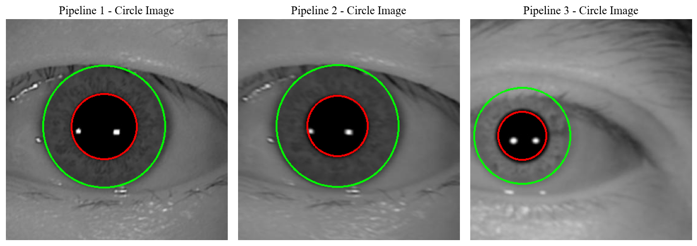
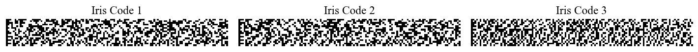

# Biometric-Iris-Recognition
Using Daugman's Algorithm and basic computer vision techniques for iris recognition.

## Project structure

```
Biometric-Iris-Recognition/
├── dash_app.py # Dash application for interactive iris recognition demo
├── demonstration.ipynb # Jupyter notebook showcasing the full system functionality
├── data/ # Folder containing the dataset (not included in the repository)
│ └── ...
├── src/ # Source code for the project
│ ├── pipeline.py # Pipeline class for iris recognition
│ ├── normalization.py # Functions for iris normalization
│ ├── encoding.py # Functions for iris encoding
│ └── helpers.py # Utility functions used across the project
└── img/ # Folder for storing output images from demonstration.ipynb
```

## Usage
### Dataset
To run this project, you need to download the dataset from [CASIA-Iris-Syn on Kaggle](https://www.kaggle.com/datasets/monareyhanii/casia-iris-syn). Once downloaded, place the dataset in the `data/` folder in the root directory of the project. The folder structure should look like this:

```
data/
├── 000/
├── 001/
└── ...
```

### Running the Dash App
For a quick demonstration, you can run the Dash app by executing the following command:

```bash
python dash_app.py
```

Make sure you have an activated Python environment with all the required packages installed. You can install the dependencies using the ```requirements.txt``` file:

```bash
pip install -r requirements.txt
```

### Demonstration Notebook
For a detailed walkthrough of all functionalities of the project, including segmentation, normalization, and encoding, open the ```demonstration.ipynb``` notebook. This notebook provides a step-by-step explanation of the system.

## Results


*Figure 1: Image of 3 eyes (2 first are of the same person) with the iris segmented on the images.*


*Figure 2: Iris Codes for the images above.*


